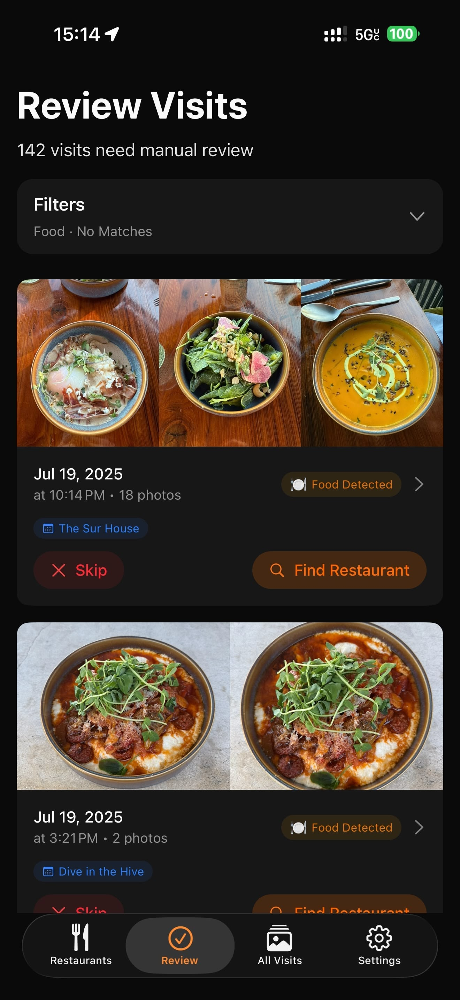
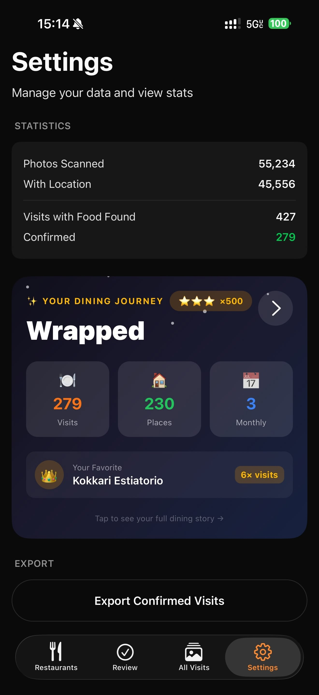

# Photo Foodie 🍽️📸

A mobile app that automatically discovers your restaurant visits by analyzing your camera roll. It groups photos by location and time, detects food using on-device ML, and matches visits to restaurants — including 15,000+ Michelin-rated establishments worldwide.


## Screenshots

<p align="center">
  
  
  
</p>

## Features

- **Camera Roll Scanning** — Batch processes your entire photo library with native performance
- **Location Clustering** — Groups photos into visits based on GPS coordinates and time proximity
- **Food Detection** — Uses on-device Vision ML to identify food photos within each cluster
- **Michelin Matching** — Automatically suggests nearby Michelin-starred restaurants (1-3 stars, Bib Gourmand, Selected)
- **Apple Maps + Google Places** — Search any restaurant via MapKit or Google Maps API
- **Calendar Integration** — Matches visits to calendar events and creates visits from reservation entries
- **Review Workflow** — Confirm, reject, or reassign restaurant matches
- **Visit History** — Track all confirmed restaurants with visit counts and photo galleries

## Prerequisites

- Node.js 24+
- Yarn 4 (set via `packageManager` in package.json)
- Xcode 15+ (for iOS)
- Android Studio (for Android)
- A physical device recommended (iOS Simulator lacks photo library with location data)

> **Note:** Expo Go is not supported due to native module dependencies.

## Getting Started

### 1. Install

```bash
yarn install
```

### 2. Build and Run

```bash
# iOS
yarn ios

# Android
yarn android
```

### 3. Grant Permissions

When prompted, grant **full photo library access** — the app needs to read GPS metadata from all photos to discover restaurant visits.

## How It Works

### 1. Scanning

The app reads all photos from your camera roll, extracting photo IDs, timestamps, and GPS coordinates. On iOS, a custom native module (`BatchAssetInfo`) processes photos in batches for maximum speed.

### 2. Clustering

Photos are grouped into "visits" using a spatial-temporal algorithm:

- Photos within **2 hours** of each other AND
- Within **200 meters** of each other

Each cluster represents a potential restaurant visit.

### 3. Food Detection

A sample of photos from each cluster is analyzed using iOS Vision framework to detect food content. Visits with detected food are prioritized in the review queue.

### 4. Restaurant Matching

For each cluster, the app suggests nearby Michelin restaurants (within 100m). The bundled dataset includes 3-star, 2-star, 1-star, Bib Gourmand, and Michelin Selected restaurants.

### 5. Calendar Enrichment

The app matches visits to calendar events and can create visits directly from restaurant reservations in your calendar.

### 6. Review & Confirm

Users review pending visits in the **Review** tab — confirm the suggested restaurant, search for a different one, or reject as not a restaurant visit.

## Tech Stack

| Layer              | Technology                                                                              |
| ------------------ | --------------------------------------------------------------------------------------- |
| **Framework**      | [Expo SDK 54](https://expo.dev) + React Native 0.81                                     |
| **Navigation**     | [Expo Router](https://docs.expo.dev/router/introduction/) with typed routes             |
| **Database**       | [Expo SQLite](https://docs.expo.dev/versions/latest/sdk/sqlite/) (WAL mode)             |
| **State**          | [Zustand](https://zustand-demo.pmnd.rs/) + [TanStack Query](https://tanstack.com/query) |
| **Styling**        | [Uniwind](https://uniwind.dev) (Tailwind CSS for React Native)                          |
| **Animations**     | [React Native Reanimated](https://docs.swmansion.com/react-native-reanimated/)          |
| **Lists**          | [FlashList](https://shopify.github.io/flash-list/)                                      |
| **Native Modules** | Custom Swift modules for batch asset processing, food detection, and MapKit search      |

## Project Structure

```
├── app/                      # Expo Router pages
│   └── (app)/(tabs)/         # Bottom tab screens
│       ├── index.tsx         # Home (restaurants list)
│       ├── review.tsx        # Pending visits review
│       ├── visits.tsx        # All visits gallery
│       └── settings.tsx      # App settings
├── components/               # Reusable UI components
│   ├── home/                 # Home screen components
│   ├── ui/                   # Design system primitives
│   ├── visit/                # Visit detail components
│   └── AwesomeGallery/       # Photo gallery viewer
├── hooks/                    # React hooks & queries
├── modules/                  # Native Expo modules
│   ├── batch-asset-info/     # iOS Swift module for photo processing & food detection
│   └── mapkit-search/        # iOS Swift module for Apple Maps search
├── services/                 # Business logic
│   ├── scanner.ts            # Photo scanning
│   ├── visit.ts              # Clustering & visit processing
│   ├── places.ts             # Google Places API
│   ├── michelin.ts           # Michelin data loader
│   └── calendar.ts           # Calendar integration
├── store/                    # Zustand stores
├── utils/                    # Utilities
│   └── db.ts                 # SQLite database layer
└── assets/
    └── michelin.csv          # 15k+ Michelin restaurants
```

## Scripts

```bash
yarn start        # Start Expo dev server
yarn ios          # Build and run on iOS
yarn android      # Build and run on Android
yarn typecheck    # Run TypeScript checks
yarn lint         # Run ESLint
yarn clean        # Remove build artifacts & node_modules
```
